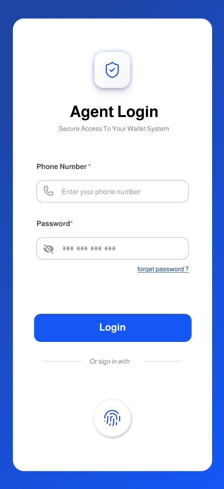
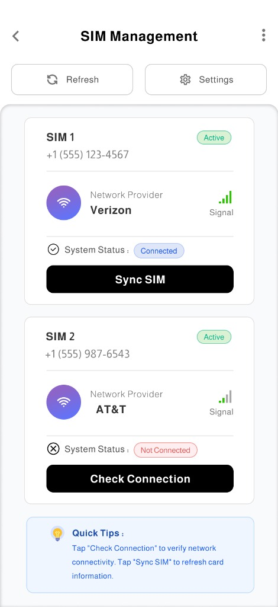
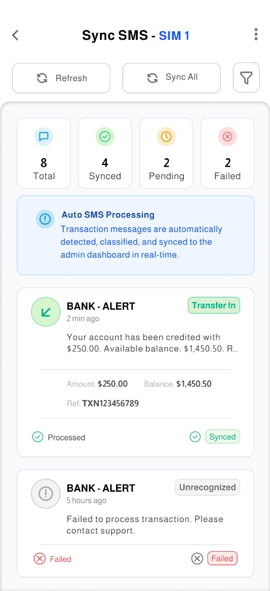
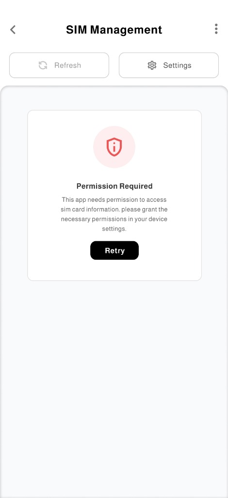

# FinTrackr

A secure, intelligent financial management application designed to bridge the gap between your mobile network and your financial transactions.

Built with **Flutter**, this application provides a seamless interface for managing multi-SIM environments, synchronizing SMS transaction alerts securely, and offering real-time financial insights.

---

## 📸 App Preview

<p align="center">
  
  
  
  
</p>

> _Secure Login, Advanced SIM Control, and Real-time Transaction Sync._

---

## ✨ Key Features

### 🔐 Secure Authentication

- **Biometric Login**: Seamlessly access your wallet using Fingerprint or Face ID.
- **PIN Protection**: Fallback secure PIN mechanism.
- **Auto-Lock**: Intelligent session management for enhanced security.

### 📶 Advanced SIM Management

- **Dual SIM Support**: Monitor status and signal strength for multiple SIM cards (Verizon, AT&T, etc.).
- **Network Health**: Real-time connection status checks.
- **One-Tap Sync**: Instantly synchronize SIM data with the backend.

### 📩 Smart SMS Synchronization

- **Transaction Detection**: Automatically identifies and categorizes bank alerts and transaction messages.
- **Real-Time Sync**: Pushes financial SMS to the admin dashboard instantly.
- **Status Tracking**: Visual indicators for Synced, Pending, and Failed messages.

---

## 🛠️ Technology Stack

This project leverages a modern, scalable architecture:

- **Framework**: [Flutter](https://flutter.dev) (Dart)
- **State Management**: [Flutter Bloc](https://pub.dev/packages/flutter_bloc) for predictable state transitions.
- **Routing**: [GoRouter](https://pub.dev/packages/go_router) for robust navigation and deep linking.
- **Security**: `local_auth` for biometrics and secure permission handling.
- **Architecture**: Clean Architecture with Dependency Injection via `get_it`.
- **UI/UX**: Custom design system with glassmorphism effects and `shimmer` loading states.

---

## 🚀 Getting Started

### Prerequisites

- Flutter SDK (v3.8.1+)
- Android Studio / VS Code
- Android Emulator or Physical Device

### Installation

1. **Clone the repository**

   ```bash
   git clone https://github.com/yourusername/fintech-sim-manager.git
   cd fintech_task
   ```

2. **Install dependencies**

   ```bash
   flutter pub get
   ```

3. **Run the app**
   ```bash
   flutter run
   ```

---

## 📱 Project Structure

```
lib/
├── core/           # Utilities, DI, Network Configuration
├── features/       # Feature modules
│   ├── auth/            # Login & Registration logic
│   ├── sim_management/  # SIM card listings & settings
│   └── sms_sync/        # SMS parsing & synchronization
└── main.dart       # App Entry point
```

---

_© 2026 Fintech SIM Manager. Confidential & Proprietary._
